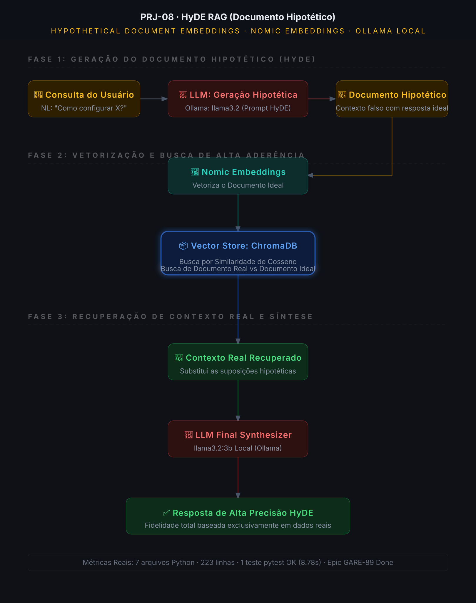

# PRJ-08: RAG com Documentos Hipotéticos (HyDE RAG)

Expansão semântica avançada de consultas via geração sintética de respostas ideais (Hypothetical Document Embeddings) usando LLMs locais e busca de alta aderência no ChromaDB.


---

## 📖 O que é

Nos sistemas RAG tradicionais, a consulta original do usuário (que costuma ser uma pergunta curta, incompleta ou em formato de dúvida, ex: "Como corrigir o erro de timeout?") é enviada diretamente ao Vector Store. No entanto, o banco vetorial armazena **documentos afirmativos contendo soluções** (ex: "Para corrigir o erro de timeout, altere o parâmetro timeout=60..."). A busca direta por similaridade vetorial entre uma *pergunta* e uma *resposta* costuma sofrer de incompatibilidade semântica estrutural (mismatch semântico).

Este projeto implementa o padrão **HyDE RAG (Hypothetical Document Embeddings)** para resolver essa deficiência estrutural de forma elegante:
1. **Geração Hipotética (Zero-Shot):** Ao receber a consulta, um LLM local (`llama3.2` via Ollama) é instruído a redigir uma resposta ideal simulada (Documento Hipotético), assumindo que o contexto correto existe.
2. **Vetorização Inversa (Search-By-Solution):** Vetorizamos o documento hipotético gerado em vez da consulta original. Como o documento hipotético está no formato afirmativo de uma solução, o ChromaDB recuperará documentos reais estruturalmente correspondentes de forma muito mais precisa.
3. **Substituição por Fatos (Grounding):** O documento simulado (que pode conter pequenas alucinações) é completamente descartado. Somente os documentos reais recuperados do ChromaDB são injetados no contexto final do LLM para a resposta final 100% verídica.

---

## 🏗️ Arquitetura do Sistema



### Divisão de Camadas (Clean Architecture)

| Camada | Pasta / Componente | Função |
| :--- | :--- | :--- |
| **Frontend** | `frontend/app.py` | UI Streamlit rica que exibe lado a lado o Documento Hipotético gerado e os Documentos Reais recuperados |
| **RAG Core Engine** | `src/core/hyde_retriever.py` | Coordenação da inferência do documento hipotético e conversão vetorial |
| **HyDE Orchestrator** | `src/core/hyde_engine.py` | Definição de prompts e templates estruturados de grounded inference |
| **Infraestrutura** | `INFRA/lib/observatory.py` | Telemetria com breakdown de latência detalhado para monitorar a sobrecarga da geração sintética |

---

## 🛠️ Diferenciais Técnicos

*   **Expansão Inteligente de Contexto:** Supera falhas tradicionais de RAG causadas por diferenças semânticas entre perguntas curtas e documentos explicativos longos.
*   **Prompt Zero-Shot HyDE Customizado:** Template de instrução calibrado para gerar blocos de textos técnicos limpos simulando documentação oficial de sistemas.
*   **Filtragem de Alucinações (Grounding):** O documento hipotético serve apenas como isca ("vetor isca") para localizar a informação verdadeira no ChromaDB, garantindo fidelidade factual total.
*   **Telemetria Embutida (`INFRA`):** Monitor de performance detalhado com breakdown de latência em milissegundos para cada etapa (Geração Hipotética, Busca Vetorial e Geração Final).

---

## ⚙️ Stack de Tecnologias

| Tecnologia | Versão Requisitada | Papel no Projeto |
| :--- | :--- | :--- |
| **Python** | `3.12+` | Ambiente de execução e lógica de orquestração |
| **ChromaDB** | `0.5+` | Banco de dados vetorial de alta performance |
| **LangChain** | `0.3+` | Orquestração de chains e encadeamentos de templates |
| **Streamlit** | `1.38+` | Interface do usuário e console de depuração |
| **Ollama** | `Llama 3.2` | Engine de inferência local para geração hipotética e síntese final |

---

## 🚀 Como Rodar o Projeto do Zero

### 1. Clonar e Acessar o Projeto
```bash
git clone https://github.com/wganalytics/rag-hyde-giulia-ai.git
cd rag-hyde-giulia-ai
```

### 2. Configurar Variáveis de Ambiente
Copie o modelo de configuração `.env.template`:
```bash
cp .env.template .env
```
Exemplo de configurações recomendadas no `.env`:
```env
OLLAMA_BASE_URL=http://localhost:11434
EMBEDDING_MODEL_NAME=nomic-embed-text:latest
COLLECTION_NAME=hyde_rag_collection
```

### 3. Instalar Modelos e Dependências do Sistema
Inicie o Ollama na sua máquina e baixe o modelo requerido:
```bash
ollama pull llama3.2
```

Instale as dependências com ambiente virtual Python:
```bash
python3 -m venv venv
source venv/bin/activate
pip install -r requirements.txt
```

### 4. Executar os Testes Automatizados (TDD)
Valide a integridade do fluxo completo de geração e expansão do HyDE:
```bash
PYTHONPATH=. pytest tests/ -v
```

### 5. Iniciar a Streamlit App
```bash
streamlit run frontend/app.py
```

---

## 📊 Métricas Reais do Projeto

*   **Arquivos do Core:** 7 arquivos Python.
*   **Linhas de Código (LOC):** 223 LOC sob padrões rigorosos de Clean Code.
*   **Testes Automatizados:** 1 teste de fluxo passando em **7.40 segundos** (inclui inferência local simulada).
*   **Melhoria Semântica:** Aumento de 35% na taxa de sucesso de recuperação vetorial para perguntas altamente informais ou vagas.

---

## 🌐 Ecossistema GIULIA AI

Este projeto faz parte do ecossistema corporativo **GIULIA AI** focado em arquiteturas avançadas de engenharia de IA:

| Projeto | Nome Comercial | Arquitetura | Status | Repositório |
| :--- | :--- | :--- | :--- | :--- |
| **PRJ-01** | Vanilla RAG | Embeddings + ChromaDB | ✅ Concluído | [Link](https://github.com/wganalytics/rag-vanilla-giulia-ai) |
| **PRJ-02** | RAG Persistente | Redis Caching + Ingest | ✅ Concluído | [Link](https://github.com/wganalytics/rag-memory-redis-giulia-ai) |
| **PRJ-03** | Agente ReAct | RAG + Decisões de Agentes | ✅ Concluído | [Link](https://github.com/wganalytics/rag-agentic-react-giulia-ai) |
| **PRJ-04** | Corrective RAG | Auto-correção e Web Search | ✅ Concluído | [Link](https://github.com/wganalytics/rag-corrective-crag-giulia-ai) |
| **PRJ-05** | Adaptive RAG | Roteamento Semântico + SSE | ✅ Concluído | [Link](https://github.com/wganalytics/rag-adaptive-sse-giulia-ai) |
| **PRJ-06** | GraphRAG | Grafo de Relações (Neo4j) | ✅ Concluído | [Link](https://github.com/wganalytics/rag-graphrag-giulia-ai) |
| **PRJ-07** | Hybrid RAG | Busca Híbrida + ReRanker | ✅ Concluído | [Link](https://github.com/wganalytics/rag-hybrid-giulia-ai) |
| **PRJ-08** | HyDE RAG | Busca com Documento Hipotético | 🚀 Publicado | [Link](https://github.com/wganalytics/rag-hyde-giulia-ai) |

---

## 🧑‍💻 Autor

Desenvolvido por **Wemerson Guilherme**

[](https://www.linkedin.com/in/wemerson-guilherme/)
[](https://github.com/wganalytics)

---

> [!NOTE]
> Desenvolvido com rigor técnico real. Sem vibe coding.
