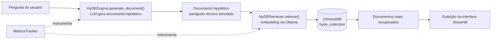

# PRJ-08 — HyDE RAG: Tradutor de Intenção

Oitavo e último projeto da progressão de técnicas de RAG do ecossistema GIULIA AI (PRJ-01 a PRJ-08): implementa **HyDE (Hypothetical Document Embeddings)**, uma técnica que traduz a intenção por trás de uma pergunta curta ou ambígua em um documento hipotético rico o bastante para guiar a busca vetorial até os trechos certos.

## Visão geral

Em um RAG convencional, a pergunta do usuário é embeddada diretamente e comparada por similaridade com os vetores dos documentos indexados. O problema: perguntas curtas ("Onde o escopo deve ficar?") carregam pouca informação semântica e tendem a ficar longe, no espaço vetorial, dos parágrafos técnicos que de fato respondem a elas — que usam vocabulário, estrutura e nível de detalhe muito diferentes de uma pergunta.

HyDE ataca esse descompasso invertendo a ordem das operações:

1. A pergunta do usuário **não** é embeddada diretamente.
2. Um LLM primeiro gera um **documento hipotético** — um parágrafo escrito como se fosse a resposta ideal, extraída de um manual técnico ou artigo especializado, ainda que o LLM não tenha certeza factual do conteúdo.
3. Esse documento hipotético — estruturalmente parecido com os documentos reais da base — é o que é embeddado e usado na busca por similaridade no ChromaDB.
4. Os documentos reais recuperados dessa forma tendem a ser mais relevantes do que os recuperados a partir do embedding da pergunta crua, porque a busca está comparando "documento com documento" em vez de "pergunta com documento".

O projeto não faz a etapa final de geração de resposta a partir dos documentos recuperados (não há um passo de "responda usando este contexto") — o foco é demonstrar e instrumentar a etapa de tradução de intenção e recuperação, que é onde o ganho do HyDE acontece.

## Funcionalidades

- **Geração de documento hipotético** (`HyDEEngine`) a partir da pergunta do usuário, via LLM configurável.
- **Busca por similaridade guiada pelo documento hipotético** (`HyDERetriever`), com ChromaDB como vector store.
- **Busca padrão para comparação** (`retrieve_standard`): embeda a pergunta crua, útil para contrastar com o resultado do HyDE.
- **Ingestão de texto de teste** diretamente pela interface, sem precisar de um pipeline de ingestão separado.
- **Seletor de motor de LLM multi-provider**, que só oferece o que está de fato funcionando na máquina (ver seção própria abaixo).
- **Observabilidade embutida**: cada etapa (geração do documento hipotético, recuperação) é cronometrada e logada via `MetricsTracker`/`track_step`, com aba dedicada na interface mostrando telemetria em tempo real e histórico das últimas execuções.

## Arquitetura



O embedding usado na busca (`OllamaEmbeddings`) é sempre local, independente de qual provider gera o documento hipotético — trocar o modelo de embedding invalidaria o banco vetorial já indexado, então essa peça não faz parte do sistema multi-provider.

## Stack tecnológica

| Camada | Tecnologia |
|---|---|
| Linguagem | Python 3.12 |
| Orquestração LLM | LangChain (`langchain-core`, `langchain-community`) |
| Geração do documento hipotético | Ollama, Google Gemini, xAI Grok ou Groq Cloud (ver seção multi-provider) |
| Embeddings | Ollama (`OllamaEmbeddings`, modelo padrão `nomic-embed-text:latest`) |
| Vector store | ChromaDB (`langchain-chroma`), persistido em disco |
| Interface | Streamlit (`frontend/app.py`) |
| Observabilidade | `MetricsTracker` / `track_step` (`shared/infra/lib/observatory.py`, compartilhado no monorepo) |
| Testes | pytest |
| Containerização | Docker / Docker Compose (via PRJ-09) |

## Suporte multi-provider de LLM

A geração do documento hipotético não está presa a um único provider. `src/core/llm_factory.py` é o único ponto do projeto que sabe qual classe concreta de chat model instanciar — o resto do código (`HyDEEngine`) apenas pede um LLM e recebe um `BaseChatModel` pronto.

Providers suportados:

| Provider | Uso | Variável de chave | Variável de modelo | Modelo padrão |
|---|---|---|---|---|
| `ollama` | Local, sem custo, sem chave | — | `OLLAMA_MODEL_NAME` (ou `HYDE_MODEL_NAME`, legado) | `llama3.2:3b` |
| `gemini` | Google Gemini | `GEMINI_API_KEY` ou `GOOGLE_API_KEY` | `GEMINI_MODEL_NAME` | `gemini-2.5-flash` |
| `grok` | xAI Grok | `XAI_API_KEY` | `GROK_MODEL_NAME` | `grok-4-latest` |
| `groq` | Groq Cloud | `GROQ_API_KEY` | `GROQ_MODEL_NAME` | `llama-3.3-70b-versatile` |

O provider padrão é escolhido por `LLM_PROVIDER` no `.env`; sem essa variável, cai em `ollama`. `grok` (xAI) e `groq` (Groq Cloud) são empresas diferentes com SDKs e chaves próprios — a nomenclatura próxima é proposital do lado dos providers, não deste projeto.

Cada provider passa por dois níveis de diagnóstico, expostos via `describe_provider`/`probe_provider`:

- **`available`**: a configuração está completa (SDK instalado + chave presente). Não garante que o provider responde.
- **`verified`**: uma chamada real já foi feita e respondeu. Distingue "configurado" de "efetivamente funcionando" — uma conta pode ter chave válida e SDK instalado e ainda assim recusar toda chamada por falta de crédito.

Falhas reais são classificadas em categorias acionáveis (`classificar_falha`): sem crédito, chave inválida, limite de requisições, modelo inexistente, falha de rede. A classificação lida com ambiguidades reais dos provedores — por exemplo, a xAI devolve falta de crédito como HTTP 403 `permission-denied`, indistinguível à primeira vista de uma chave revogada; e o Google devolve limite de requisições por minuto do free tier como 429 com menção a "billing", que sem a ordem certa de checagem seria classificado como falta de crédito.

Na interface (`frontend/seletor_llm.py`), o seletor de motor testa cada provider uma vez por processo e só oferece por padrão os que responderam com sucesso, com opção de mostrar também os indisponíveis (e o motivo da falha). Para o Ollama especificamente, o seletor de modelo consulta o daemon local (`/api/tags`) e lista apenas os modelos de chat realmente instalados na máquina — não um campo de texto livre nem uma lista fixa no código.

## Estrutura de pastas

```
PRJ-08_HyDE_RAG/
├── conftest.py                  # Põe a raiz do monorepo no sys.path para os testes locais
├── requirements.txt
├── .env.template
├── frontend/
│   ├── app.py                   # Interface Streamlit principal
│   └── seletor_llm.py           # Seletor de motor de LLM (compartilhado no padrão do ecossistema)
├── src/
│   ├── __init__.py
│   ├── api/
│   │   └── __init__.py
│   └── core/
│       ├── __init__.py
│       ├── hyde_engine.py       # HyDEEngine: gera o documento hipotético
│       ├── hyde_retriever.py    # HyDERetriever: ingestão e busca no ChromaDB
│       └── llm_factory.py       # Fábrica multi-provider de LLMs
├── tests/
│   ├── test_hyde.py             # Teste de ponta a ponta do pipeline HyDE
│   ├── test_llm_factory.py      # Resolução de provider/modelo, construção de LLMs
│   └── test_provider_health.py  # Classificação de falhas e diagnóstico de saúde dos providers
├── data/
│   └── vector_db/               # Persistência do ChromaDB (ignorado no Git)
├── app/, docs/, notebooks/, scripts/, assets/   # Pastas reservadas do padrão de projeto, hoje vazias
└── project_context/, specs/     # Contexto operacional e specs do projeto
```

## Como rodar

### Local (standalone)

Pré-requisitos: Python 3.12, Ollama rodando localmente com um modelo de chat instalado (ex.: `llama3.2:3b`) e o modelo de embedding (`nomic-embed-text:latest`).

```bash
# a partir da raiz do monorepo, com o venv do projeto ativo
pip install -r dev/rag/PRJ-09_Deploy_Cloud/docker/requirements.txt

cd dev/rag/PRJ-08_HyDE_RAG
cp .env.template .env   # preencher LLM_PROVIDER e, se aplicável, a chave do provider escolhido

streamlit run frontend/app.py
```

As dependências reais do projeto (LangChain, ChromaDB, Streamlit, SDKs de cada provider, etc.) estão consolidadas em `dev/rag/PRJ-09_Deploy_Cloud/docker/requirements.txt`, compartilhado por todos os projetos PRJ-01 a PRJ-08 do monorepo — o `requirements.txt` local deste projeto é apenas um placeholder.

Rodando localmente (fora de container), este projeto importa `shared.infra.lib.observatory`, que vive na raiz do monorepo. O `conftest.py` resolve isso para os testes; para rodar a interface fora de container, garanta que a raiz do monorepo esteja no `PYTHONPATH` (o próprio `frontend/app.py` já adiciona os diretórios necessários ao `sys.path` no topo do arquivo).

### Via Docker (orquestrado pelo PRJ-09)

Este projeto não sobe sozinho em container — ele faz parte da orquestração única do PRJ-09_Deploy_Cloud, que builda uma imagem compartilhada para os PRJ-01 a PRJ-08 e monta a raiz do monorepo em `/app`.

```bash
cd dev/rag/PRJ-09_Deploy_Cloud
docker compose up -d prj-08-ui
```

A interface fica disponível em `http://localhost:8508`. O Ollama continua rodando no host (não em container) e é alcançado via `host.docker.internal`; a variável `PYTHONPATH=/app` é injetada pelo compose para resolver o import de `shared.infra.lib.observatory` dentro do container.

## Testes

```bash
pytest tests/ -q
```

Suite atual: **48 testes passando**, cobrindo o pipeline HyDE de ponta a ponta (`test_hyde.py`), resolução de provider/modelo e construção de LLMs (`test_llm_factory.py`), e classificação de falhas/diagnóstico de saúde dos providers (`test_provider_health.py`).

## Problemas encontrados e corrigidos

- **Import quebrado pela reorganização do monorepo.** `hyde_retriever.py` e `hyde_engine.py` importavam `from INFRA.lib.observatory import MetricsTracker, track_step`, caminho que existia antes de o monorepo ser reorganizado. O módulo foi movido para `shared/infra/lib/observatory.py`. Correção: os dois arquivos passaram a importar de `from shared.infra.lib.observatory import ...`; `PYTHONPATH=/app` foi adicionado ao `docker-compose.yml` do PRJ-09 (o módulo vive na raiz do monorepo, montada em `/app` dentro do container); e `conftest.py` foi criado para os testes locais encontrarem o módulo também fora de container.
- **Lista fixa de modelos com item não instalado.** A interface oferecia um `st.selectbox("Modelo HyDE", ["llama3.2:3b", "llama3.1:8b"])` fixo no código — e `llama3.1:8b` não estava sequer instalado no Ollama da máquina usada para desenvolvimento. Selecionar essa opção só falhava na hora de gerar o documento hipotético, sem aviso prévio. Correção: a lista fixa foi removida da sidebar; o modelo agora vem do seletor de motor de LLM (`seletor_llm.py`), que consulta o daemon do Ollama em tempo real (`/api/tags`) e só oferece os modelos de chat realmente instalados.

## Limitações conhecidas / decisões de engenharia

- **Sem etapa de geração de resposta final.** O pipeline termina na recuperação dos documentos reais; não há um passo de "responda a pergunta usando este contexto". O escopo do projeto é a tradução de intenção e a qualidade da recuperação, não um chatbot completo.
- **Embedding sempre local via Ollama**, independentemente do provider escolhido para gerar o documento hipotético. Trocar o modelo de embedding invalidaria o banco vetorial já indexado, então essa peça foi deliberadamente deixada fora do sistema multi-provider.
- **Sem API própria.** Ao contrário de projetos anteriores da série (ex.: PRJ-01, PRJ-02), este projeto só expõe uma interface Streamlit que acessa o ChromaDB diretamente — não há uma camada FastAPI separada.
- **`requirements.txt` local é um placeholder.** As dependências reais são consolidadas em um único arquivo compartilhado pelo PRJ-09 para todos os projetos PRJ-01 a PRJ-08, evitando manter e reconstruir oito imagens quase idênticas.
- **Persistência do vector store é local em disco** (`data/vector_db/`), ignorada pelo Git — cada ambiente (local ou container) constrói sua própria base a partir da ingestão feita pela interface.
