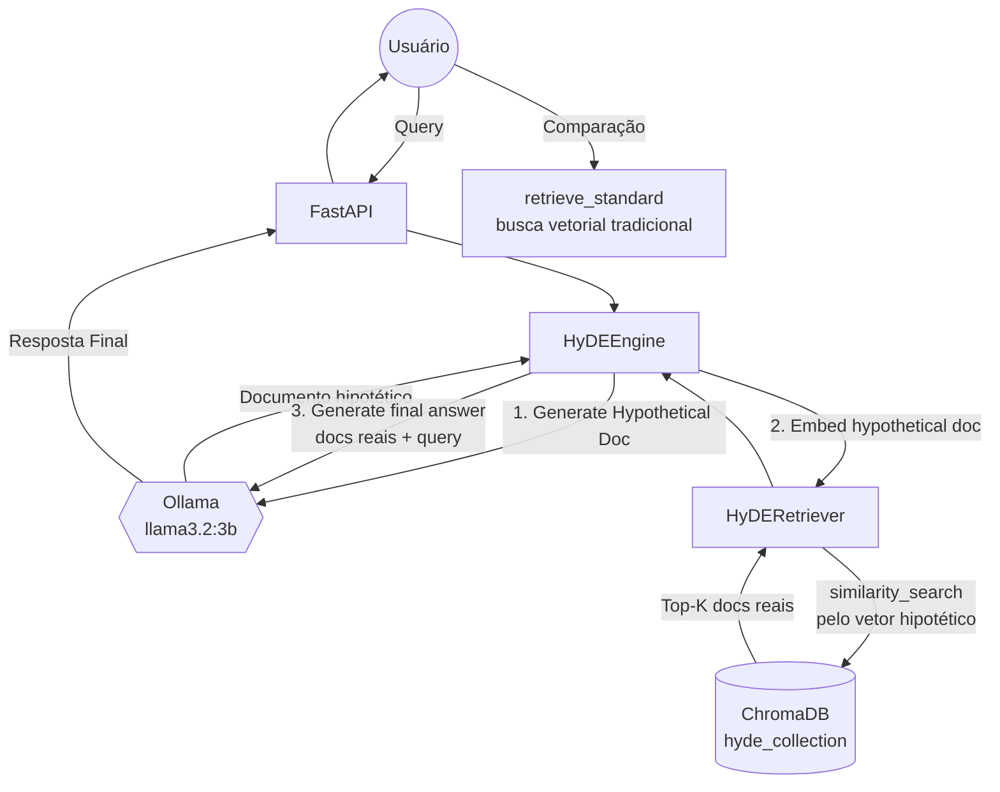

# PRJ-08_HyDE_RAG — Spec (SDD)

> **Padrão Oficial:** BMAD + SDD + TDD  
> **Última Atualização:** 2026-05-24  
> **Status:** ✅ Concluído | **Jira:** GARE-81

---

## 1. 🏗️ BMAD (Baseline Architecture)

*Hypothetical Document Embeddings: gera resposta ideal hipotética para melhorar a busca semântica.*



---

## 2. 📝 SDD (Spec-Driven Development)

### Objetivo Principal
Implementar **Hypothetical Document Embeddings (HyDE)**. Em vez de buscar no VectorDB usando o embedding da query diretamente (que pode ser semanticamente pobre), o sistema primeiro **gera um documento hipotético ideal** via LLM e usa o embedding desse documento hipotético para buscar documentos reais. Melhora recall em domínios técnicos onde queries são curtas mas documentos são longos.

### Módulos Essenciais

| Módulo | Responsabilidade |
|--------|-----------------|
| `hyde_engine.py: HyDEEngine` | Gera documento hipotético via prompt especializado |
| `hyde_retriever.py: HyDERetriever` | Busca via embedding do doc hipotético; também oferece `retrieve_standard()` para comparação |
| `HyDEEngine.generate_document()` | Prompt: "escreva como se fosse de um manual técnico oficial" → doc hipotético |
| `HyDERetriever.retrieve()` | `similarity_search(hypothetical_doc, k=3)` — busca pelo doc hipotético |
| `HyDERetriever.retrieve_standard()` | `similarity_search(query, k=3)` — busca tradicional (A/B comparison) |

### Configurações (via `.env`)

| Variável | Padrão | Descrição |
|----------|--------|-----------|
| `HYDE_MODEL_NAME` | `llama3.2:3b` | Modelo gerador do documento hipotético |
| `EMBEDDING_MODEL_NAME` | `nomic-embed-text:latest` | Embeddings para ChromaDB |
| `OLLAMA_BASE_URL` | `http://localhost:11434` | Endpoint Ollama |

### Prompt HyDE (Design crítico)

```
"Você é um especialista técnico. Por favor, escreva um parágrafo que responda
diretamente e detalhadamente à pergunta abaixo. Escreva como se estivesse
retirando este parágrafo de um manual técnico oficial ou artigo especializado.

Pergunta: {question}

Resposta Ideal Hipotética:"
```

**Rationale:** O documento hipotético gerado terá vocabulário e estilo semelhante ao dos documentos reais no corpus, aumentando similaridade cossenoidal na busca.

### Capacidade de Comparação A/B

O `HyDERetriever` expõe dois métodos intencionalmente:
- `retrieve(hypothetical_doc)` — busca HyDE
- `retrieve_standard(query)` — busca tradicional

Isso permite que a UI exiba comparação lado a lado, demonstrando a superioridade do HyDE em domínios técnicos.

### Observabilidade

Ambos os métodos de retrieve são decorados com `@track_step()` do `INFRA.lib.observatory` para capturar métricas comparativas de latência e relevância entre as duas estratégias.

### Guardrails

- **Temperatura 0.0:** `HyDEEngine` usa `temperature=0.0` para documentos hipotéticos determinísticos e técnicos (menos "criativos", mais precisos semanticamente)
- **`k=3` conservador:** Retriever usa `k=3` por padrão para evitar ruído em bases pequenas
- **Diretório auto-criado:** `os.makedirs(persist_directory, exist_ok=True)` no `HyDERetriever.__init__()` garante que o VectorDB exista antes da primeira query

### Fluxo de Exceções

| Cenário | Comportamento |
|---------|---------------|
| Ollama offline | `generate_document()` levanta exceção; capturado pela API |
| Chroma vazio | `similarity_search()` retorna lista vazia; resposta final sem contexto |
| Documento hipotético vazio | String vazia como query de busca; retorna docs por proximidade ao vetor zero |

---

## 3. 🧪 TDD

| Teste | Critério |
|-------|----------|
| `test_hypothetical_doc_generated` | `generate_document()` retorna string não vazia de comprimento > 100 chars |
| `test_hyde_vs_standard_different` | `retrieve()` e `retrieve_standard()` retornam conjuntos distintos de docs |
| `test_hyde_technical_vocabulary` | Doc hipotético contém termos do domínio técnico (keywords do corpus) |
| `test_retriever_k_respected` | `retrieve()` retorna no máximo `k=3` documentos |
| `test_chroma_persist_dir_created` | Diretório `data/vector_db` criado automaticamente no init |
| `test_temperature_zero` | `HyDEEngine.llm.temperature == 0.0` |
| `test_track_step_decorator` | Ambos métodos de retrieve decorados com `@track_step` |

**Status:** ✅ Validado. HyDE operacional com busca via documento hipotético e comparação A/B disponível.
